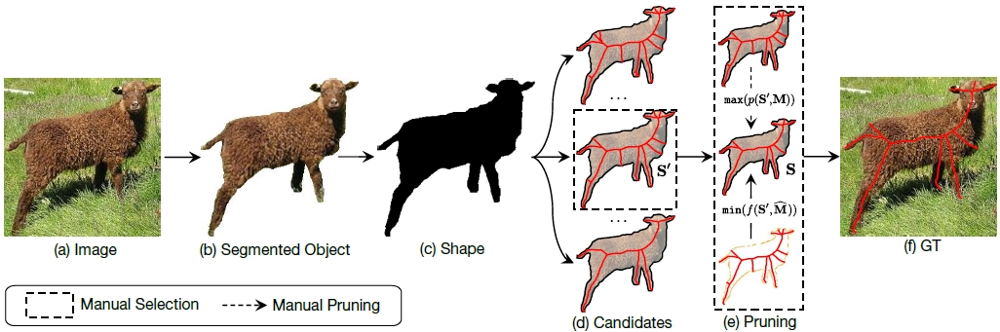
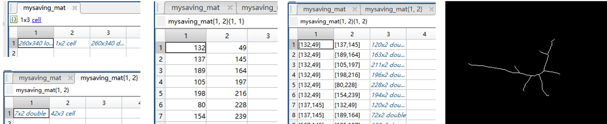

# SkeView: Skeleton Ground Truth of Shape and Image Datasets

SkeView is an annotation tool based on the theory of diagnosticity hypothesis ([Amos Tversky, Psychological Review, 1977](http://www.ai.mit.edu/projects/dm/Tversky-features.pdf)) for shape and image skeletons. Based on SkeView, we annotate high-quality skeleton Ground Truth (GT) for 17 existing shape and image datasets.

## Datasets

- Image datasets:
  - **SK506**: SK506 (also known as SK-SMALL) was selected from the MS COCO dataset, with 506 natural images (300 for training and 206 for testing) and 16 object classes, including humans, animals, and artifacts. ([Shen et al. IEEE CVPR 2016](https://openaccess.thecvf.com/content_cvpr_2016/papers/Shen_Object_Skeleton_Extraction_CVPR_2016_paper.pdf))
  - **SK1491**: SK1491 (also known as SK-LARGE) is an extension of the SK506 by selecting more images from the MS COCO dataset. It includes 1,491 images (746 for training and 745 for testing). ([Shen et al. IEEE TIP 2017](https://ieeexplore.ieee.org/abstract/document/8000414))
  - **SYMMAX300**: SYMMAX300 is adapted from the Berkeley Segmentation Dataset (BSDS300) with 300 images (200 for training and 100 for testing). There are multiple targets in most images. This dataset is used for local reflection symmetry detection, which is a low-level image feature, without paying attention to the concept of "object". ([Tsogkas et al. ECCV 2012](https://inria.hal.science/hal-00856535/document))
  - **SymPASCAL**: SymPASCAL was selected from the PASCAL-VOC dataset, with 1,435 images (648 for training and 787 for testing). Most images contain multiple targets, partial visibility, and complex backgrounds. ([Ke et al. IEEE CVPR 2017](https://openaccess.thecvf.com/content_cvpr_2017/papers/Ke_SRN_Side-output_Residual_CVPR_2017_paper.pdf))
- Both image and shape datasets:
  - **EM200**: EM200 contains 200 microscopic images (10 classes) of environmental microorganisms (EM). ([Yang et al. ICPR 2014](https://projet.liris.cnrs.fr/imagine/pub/proceedings/ICPR-2014/data/5209d374.pdf))
  - **SmithsonianLeaves**: SmithsonianLeaves contains 343 leaves (187 for training and 156 for testing) from 93 different species of plants. ([Ling et al. IEEE T-PAMI 2007](https://citeseerx.ist.psu.edu/document?repid=rep1&type=pdf&doi=c9bb27a60b6c2555a4c01c4c0b8808f1e3625403))
  - **WH-SYMMAX**: WH-SYMMAX contains 328 cropped images (228 for training and 100 for testing) from the Weizmann Horse dataset. Each image contains one manually segmented target. ([Shen et al. Pattern Recognition 2016](https://www.vlrlab.net/admin/uploads/avatars/Multiple_instance_subspace_learning_via_partial_random_projection_tree_for_local_reflection_symmetry_in_natural_images.pdf))
- Shape datasets:
  - **Animal2000**: Animal2000 contains 2,000 shapes (20 categories, 100 shapes each) ranging from poultry and domestic pets to insects and wild animals. Each class is characterized by large intra-class shape variations. ([Bai et al. ICCV Workshops 2009](http://pages.ucsd.edu/~ztu/publication/iccv09_nordia_ics.pdf))
  - **ArticulatedShapes**: ArticulatedShapes contains 40 images from eight different objects. This challenging dataset consists of various tools, including scissors with holes. ([Ling et al. IEEE T-PAMI 2007](https://citeseerx.ist.psu.edu/document?repid=rep1&type=pdf&doi=c9bb27a60b6c2555a4c01c4c0b8808f1e3625403))
  - **Kimia99**: Kimia99 contains 99 shapes (9 categories, 11 shapes each) assembled from various sources such as tools and hands, etc. ([Sebastian et al. IEEE T-PAMI 2004](https://ieeexplore.ieee.org/abstract/document/1273924))
  - **MPEG7**: MPEG7 contains 1,400 (70 categories, 20 shapes each) shapes defined by their outer closed contours. It poses challenges with respect to deformation (e.g., change of viewpoints and non-rigid object motion) and noises (e.g., quantization and segmentation noise). This dataset is actively used for benchmarking shape representation, matching, and retrieval algorithms. ([Latecki et al. IEEE CVPR 2000](https://ieeexplore.ieee.org/abstract/document/855850))
  - **Kimia216**: Kimia216 contains 216 shapes (18 categories, 12 shapes each) selected from the MPEG7 dataset. It is actively used in skeleton extraction, pruning, matching, and shape retrieval scenarios. ([Sebastian et al. IEEE T-PAMI 2004](https://ieeexplore.ieee.org/abstract/document/1273924))
  - **MPEG400**: MPEG400 contains 400 shapes selected from the MPEG7 dataset (20 categories, 20 shapes each). Instead of directly using the original shapes, boundary noises of these shapes were manually removed for ablation study. ([Yang et al. IEEE ICIP 2014](https://ieeexplore.ieee.org/abstract/document/7025446))
  - **Tetrapod120**: Tetrapod120 contains 120 tetrapod animal shapes from six classes. As the shapes of some species are visually similar, this dataset is normally employed to evaluate shape matching and fine-grained classification algorithms. ([Yang et al. Pattern Recognition 2016](https://www.sciencedirect.com/science/article/abs/pii/S0031320316000431))
  - **SwedishLeaves**: SwedishLeaves contains 1,125 leaf shapes from 15 different Swedish tree species, with 75 leaves per species (25 for training, 50 for testing). This dataset is challenging as some species are quite similar. ([Oskar Söderkvist, Linköping University, 2001](https://www.diva-portal.org/smash/get/diva2:303038/FULLTEXT01.pdf))
  - **Tari56**: Tari56 contains 56 shapes (14 categories, 4 shapes each) for evaluating matching performance under visual transformations. Shapes of the same category show variations in orientation, scale, articulation, and small boundary details. ([Asian et al. ICCV 2005](https://ieeexplore.ieee.org/abstract/document/1544875))

## Format

To ensure the smoothness of your research, we provide the original shapes/images, ground truth, and thumb on this page: 
- **Original Shapes/Images**: Original data from various sources, such as GitHub pages, personal webpages, and email exchanges. To the best of our knowledge, this is the most complete zoo of existing shape and image datasets. We do our best to push this domain forward. If you find any copyright issues, please contact me via [email](https://cong-yang.github.io/).
- **Ground Truth**: With .mat and .png formats.
  - .mat: for Matlab users. Each file contains three cells:
    - cell 1: binary shape (aa = mysaving_mat{1};)
    - cell 2: component of ground truth (aa = mysaving_mat{2};), with two sub_cells:
      - sub_cell 1: list of endpoints;
      - sub_cell 2: list of branches; Each branch is represented by endpoint1, endpoint2, and skeleton path between them. Users can conveniently evaluate skeleton matching methods (e.g., [skeleton path similarity](https://ieeexplore.ieee.org/document/4359369)) with them.
    - cell 3: binary skeleton ground truth (aa = mysaving_mat{3};)
  - .png: for Python users. A binary image with skeleton ground truth. Alternatively, users can covert the endpoint and branch lists from .mat files.
- **Thumb**: Visualization of the integrated shape/image and the ground truth.

*: Since each zip file surpasses 25M, please download them via the Google Drive disc links in the Download section.

## Download

You may download the aforementioned files via Google Drive or Baidu Disc based on your internet conditions:

- **Baidu Disc**

| Dataset  | Type | Original Data |  Ground Truth  |  Thumb  |
| ------------- | ------------- | ------------- | ------------- | ------------- |
| SK506 | image  | Content Cell | Content Cell | Content Cell |
| SK1491 | image  | Content Cell | Content Cell | Content Cell |
| SYMMAX300  | image  | Content Cell | Content Cell | Content Cell |
| SymPASCAL  | image  | Content Cell | Content Cell | Content Cell |
| EM200  | image and shape  | Content Cell | Content Cell | Content Cell |
| SmithsonianLeaves  | image and shape  | Content Cell | Content Cell | Content Cell |
| WH-SYMMAX  | image and shape  | Content Cell | Content Cell | Content Cell |
| Animal2000  | shape | Content Cell | Content Cell | Content Cell |
| ArticulatedShapes  | shape  | Content Cell | Content Cell | Content Cell |
| Kimia99  | shape  | Content Cell | Content Cell | Content Cell |
| MPEG7  | shape  | Content Cell | Content Cell | Content Cell |
| Kimia216  | shape  | Content Cell | Content Cell | Content Cell |
| MPEG400  | shape  | Content Cell | Content Cell | Content Cell |
| Tetrapod120  | shape  | Content Cell | Content Cell | Content Cell |
| SwedishLeaves  | shape  | Content Cell | Content Cell | Content Cell |
| Tari56  | shape  | Content Cell | Content Cell | Content Cell |

- **Google Drive**

| Dataset  | Type | Original Data |  Ground Truth  |  Thumb  |
| ------------- | ------------- | ------------- | ------------- | ------------- |
| SK506 | image  | Content Cell | Content Cell | Content Cell |
| SK1491 | image  | Content Cell | Content Cell | Content Cell |
| SYMMAX300  | image  | Content Cell | Content Cell | Content Cell |
| SymPASCAL  | image  | Content Cell | Content Cell | Content Cell |
| EM200  | image and shape  | Content Cell | Content Cell | Content Cell |
| SmithsonianLeaves  | image and shape  | Content Cell | Content Cell | Content Cell |
| WH-SYMMAX  | image and shape  | Content Cell | Content Cell | Content Cell |
| Animal2000  | shape | Content Cell | Content Cell | Content Cell |
| ArticulatedShapes  | shape  | Content Cell | Content Cell | Content Cell |
| Kimia99  | shape  | Content Cell | Content Cell | Content Cell |
| MPEG7  | shape  | Content Cell | Content Cell | Content Cell |
| Kimia216  | shape  | Content Cell | Content Cell | Content Cell |
| MPEG400  | shape  | Content Cell | Content Cell | Content Cell |
| Tetrapod120  | shape  | Content Cell | Content Cell | Content Cell |
| SwedishLeaves  | shape  | Content Cell | Content Cell | Content Cell |
| Tari56  | shape  | Content Cell | Content Cell | Content Cell |
 
## Citation

If you benefit from this work, please cite the mentioned and our paper:

	@article{Yang2023SkeView,
		author = {Yang, Cong and Indurkhya, Bipin and See, John and Gao, Bo and Ke, Yan and Boukhers, Zeyd and Yang, Zhenyu and Grzegorzek, Marcin},
		title = {Skeleton Ground Truth Extraction: Methodology, Annotation Tool and Benchmarks},
		journal = {International Journal of Computer Vision},
            volume = {},
            pages = {1-23},
            year = {2023}
	}
